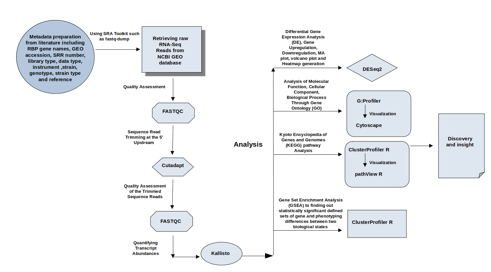
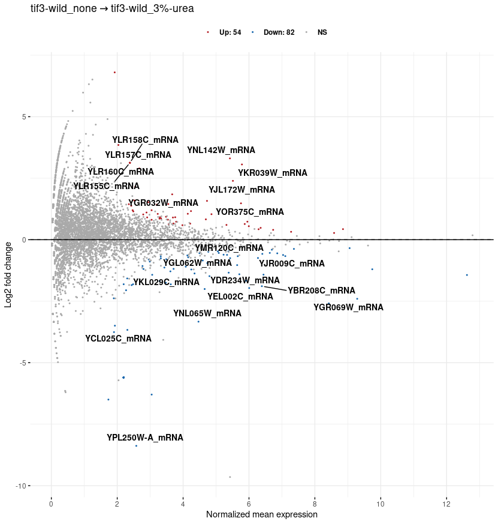
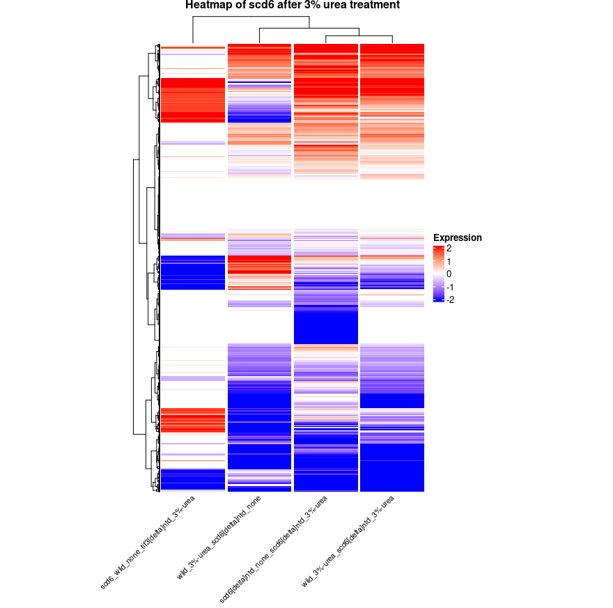
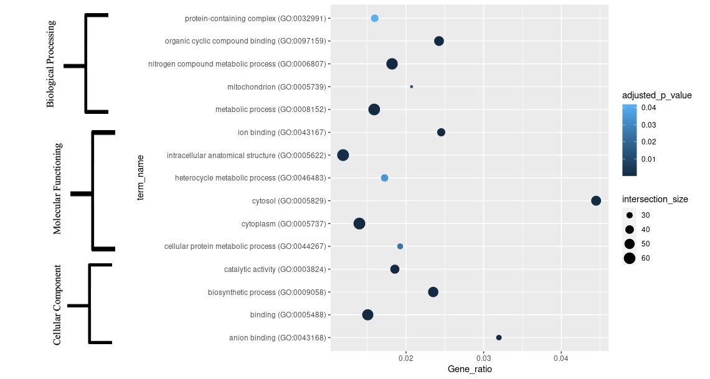
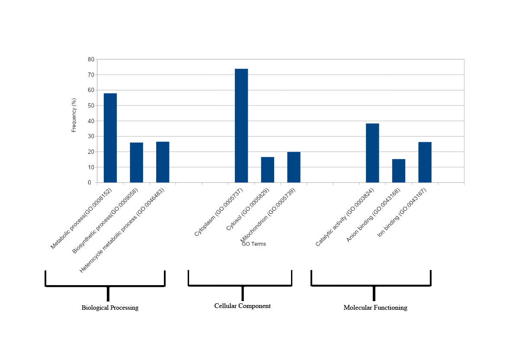
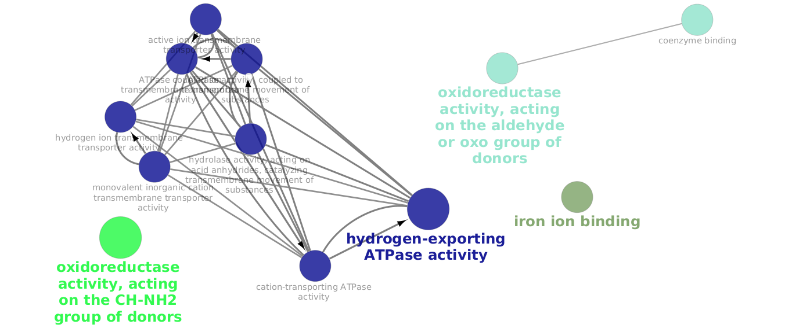

# Next Generation Sequencing (RNA-Seq) Data Analysis

### Proposed working design
<p align="center">
  
</p>


### OS
Any Linux based distro should work. Out test OS is:

Distributor ID: Ubuntu <br/>
Description:    Ubuntu 20.04.3 LTS <br/>
Release: 	20.04 <br/>
Codename:       focal <br/>

`lsb_release -a` on a Ubuntu based system.


### Software and packages
<p style='text-align: justify;'> All software should be installed by the user directly as the workflow depends on a lot of external software.
Without these the workflow will fail to run. </p>

- git

- R version 3.6.1

- Jupyter notebook 6.4.3 (python3)

- Cytoscape 3.9.1

- PyCharm Professional Edition
- conda 4.10.3
- cutadapt 3.4
- kallisto 0.46.2
- fastq-dump. 2.8.0
- Bioconductor version 3.13
- FastQC v0.11.9


## Process: 

### Downloading SRR number and quality control:
The first step of analysing Next Generation Sequencing data is to download the SRR number from the GEO NCBI database (https://www.ncbi.nlm.nih.gov/geo/). 
For downloading SRR Files only few command lines are used:

- Step-1: Downloading and Installing Miniconda

For downloading and installing Miniconda the following command lines are used:

```bash

wget https://repo.anaconda.com/miniconda/Miniconda3-latest-Linux-x86_64.sh
chmod +x Miniconda3-latest-Linux-x86_64.sh
bash ./Miniconda3-latest-Linux-x86_64.sh -b -f -p /usr/local
```
- Step-2: Installing SRA-Tools

SRA-Tools are installed by running the following code:

```bash
conda install -c bioconda sra-tools
Here,
    • -c = -c flag for specifying the appropriate channel such as bioconda.
    • bioconda = A channel for conda package specializing in management of Bioinformatics software.
    • sra-tools = Restore the original data from NCBI for example as fastq.
***In this case the conda is channeling the bioconda by -c flag to get the access to the bioinformatics tools (sra- tools, fastqc), which are carried by bioconda.
```
- Step-3: Installing fastQC

fastQC can be installed by running the following code through the Bioconda Channel:

```bash
conda install -c bioconda fastqc
```
- Step-4.1: Downloading SRR Files as decompressed files
 
For Paired End the following command line is used:

```bash
fastq-dump --split-3 SRR11072806 (Sample SRR Number)
```
For single end the following command-line is used:

```bash
fastq-dump SRR4163303 (Sample SRR Number)
```

- Step-4.2: Downloading SRR Files as Zip File

For downloading SRR files as Zip file the following command-lines are used:

For paired-End:
```bash
fastq-dump --gzip --split-3 SRR3591808 (Sample SRR Number)
```
For single-end:
```bash
fastq-dump –gzip SRR3591808 (Sample SRR Number)
```
***Fastq-Dump is SRA Tool-kit that converts data to Fastq and Fasta format.

- Step-5 : Accessing the Quality of fastq Files

The FastQC is a bioinformatics software is used to analyse the quality of fastq files. The quality is expressed as HTML file report, which has to be downloaded. The following command line is used for analyzing the quality of
decompressed fastq files:

```bash
fastqc*.fastq
```
The following command line is used for analyzing the quality of zip fastq files:

```bash
fastqc*.fastq.gz
```
The following table is represented as a sample table of RNA-seq data: 


   | Gene Name | SRR Number  | Genotype          | Treatment  | 
-----------|:------------|:------------------|:-----------|         
   | Scd6      | SRR35981808 | Wild type         | 37°C       
   | Scd6     | SRR3591816  | wild type         | 15°C       |
   | Scd6     | SRR3591810  | tif3 delta mutant | 37°C       |
   | Scd6      | SRR3591819  | tif3 delta mutant | 15°C         |

   


### Data trimming
The data is trimmed at 15-20 base pair from both upstream or downstream region using bioinformatics tool cutadapt 3.4 based on per base sequence content and per sequence GC content to ensure the quality of the fastq data. The fastq file is trimmed to remove the contaminated data. Cutadapt can be downloaded by using the following command line:

```bash
conda create -n cutadaptenv cutadapt 
```
The whole trimming process occur by using the following command lines:
For single-end fastq file:
```bash
cutadapt -u 15 -o SRR9033889_trim.fastq.gz SRR9033889.fastq.gz (Sample SRR number)
```
For pair-end fastq file:
```bash
cutadapt -u 15 -U 15 -o SRR11808657_1_trim.fastq.gz -p SRR11808657_2_trim.fastq.gz SRR11808657_1.fastq.gz SRR11808657_2.fastq.gz (Sample SRR Number)
```
FastQC v0.11.9 is used again to check the quality of the data after trimming by using the blow command line: 
```bash
fastqc *_trim.fastq.gz
```
### Data quantification 
To quantify the abundances of transcript of RNA-seq data (NGS data) kallisto is highly efficient. The abundances are reported in estimated counts (est_counts) and Transcripts per Million (TPM).  The quantification is done by indexing Saccharomyces_cerevisiae.R64-1-1.cdna.all as a parameter in 100 bootstrips. The kallisto is downloaded by using the following command line:
```bash
conda install -c bioconda kallisto
```
In regard to quantifying the read files kallisto perform pseudoalignment by processing a transcriptome file to creat a Transcriptome Index. Here, we downloaded  Saccharomyces_cerevisiae.R64-1-1.cdna.all in 100 bootstrips for pseudoalignment through the following command line:
```bash
wget http://sgd-archive.yeastgenome.org/sequence/S288C_reference/rna/rna_coding.fasta.gz 
```
For building index type: 
```bash
kallisto index -i transcripts.idx rna_coding.fasta
```
To quantify the abundance of single end reads:
```bash
kallisto quant -i transcripts.idx -o ${fqfile} --single -l 200 -s 20 -b 100 ${fqfile}_trim.fastq.gz 
```
To quantify the abundance of pair end reads:
```bash
kallisto quant -i transcripts.idx -o ${fqfile} -b 100 ${fqfile}_1_trim.fastq.gz ${fqfile}_2_trim.fastq.gz
```
The kallisto result will be in the following format:


   | target id | length | eff_length | est_counts | tpm   |
-------|:-------|:-----------|:-----------|-------|     
   | YPL071C_mRNA | 471    | 272        | 273        | 56.8  |
   | YLL050C_mRNA      | 2160   | 189        | 1343       | 336.5 |     
   | YMRF3896_mRNA | 1488   | 1289       | 456        | 54.41 |   
   | YTE1853C_mRNA | 582    | 6723       | 248        | 11.34 |   |
| 

Here, the eff_length (effective length) is calculated by the equation:

                                length-average fragment length +1 

*** The fragment length is the length of the cDNA fragment that is sequenced. Abundances are generally reported in est_counts (estimated counts) and in Transcripts Per Million (TPM).

### Differential gene expression analysis:
Differential expression of genes is analysed by the DESeq2 Bioconductor library of R version 3.6.1. The "tximport","readr" and "tximportData" libraries are also required at the same time for differential gene expression analysis. 

- The “tximport” package is used to import transcript-level abundances (TPM), estimated counts and effective lengths from the kallisto data.  
- “readr” library is used to read the provided csv file in R.
- “tximportData” package is used to store the imported transcript abundances and to construct gene-level
        DESeqDataSet object from kallisto.  

At first we have to installed Bioconductor by using the following command lines in R:
```bash

if (!require("BiocManager", quietly = TRUE))
    install.packages("BiocManager")
BiocManager::install()
```
After that the other mentioned libraries have to be installed by the subsequent command lines:
```bash
BiocManager::install("DESeq2")
BiocManager::install("tximport")
install.packages("readr")
BiocManager::install("tximportData")
```
The file type have to be kallisto and the contrast have to be in between two  different conditions (for example treatment vs control) to get the log2 fold changes, p values and adjusted p values.
log2fold-change is the log-ratio of gene expression values within two different conditions. log2 fold change value positive means the gene is upregulated and the log2 fold change value negative means the gene is downregulated. And the log2 fold change 0 means no changes. 

The adjusted p-value is calculated through the “Conservative Bonferroni Correction Method” by using the below equation:

    Adjusted p value = p-value * m (Here, m is the total number of tests)

   | gene name     | baseMean | log2FoldChange | lfcSE | stat  | pvalue | padj       | 
---------------|:---------|:---------------|:------|-------|--------|------------|
   | YPL071C_mRNA  | 114.95   | 0.495          | 0.282 | 1.747 | 0.080 | 0.124 
   | YLL050C_mRNA  | 1869.78  | -1.221         | 0.134 | -3.365 | 1.213 | 1.865 
   | YMRF3896_mRNA | 404.28   | 0.800          | 0.180 | 5.441 | 9.215  | 3.075
   | YTE1853C_mRNA | 229.57   | 0.141          | 0.244 | 0.134 | 0.529  | 0.623
| 


#### MA plot analysis: 
MA plot is used to represent log fold-change versus mean espression between two treatments. The X axis represent the normalized mean expression (A) and y axis represent the log fold change (M). MA plot is calculated using the following equation:

M=log2(x/y) 

A=(log2(x) + log2 (y))/2 
   
  = log2 (xy)*1/2

Here, x and y represent the mean of two compared groups. 
To generate MA plot is R two libraries are used such as ggplot2 and ggpubr. The two libraries can be downloaded in R:
```bash
install.packages("ggplot2")
install.packages("ggpubr")
```
- ggplot2 package is used for plotting complex plots from provided data. 
- Ggpubr package is used to generate publication standard MA plot. It generally customize ggplot2 plots. 

<p align="center">
  
</p>

Fig. 1: Representation of MA plot of two different conditions. The blue dots represented the significant downregulated genes and the red dots represented the significant upregulated genes. The grey color represent the non-significant gene. The genes were considered significance when the adjusted p value (padj<0.05) is less than 0.05.


## Heatmap analysis: 
Heatmap is used to visualize the gene expression data in a grid, where the rows represent genes and columns represent RNA-seq samples. The gene expression is the “Z-Score Scaling”, which converts the data to “Z-scores”. The center of the data is around 0. Samples with relative higher expression get positive values and relatively low expression get negative values. 
The formula for Z-score scaling:

    Z-score scaling= (sample value-the mean)/ standard deviation.
 

Several clustering distance method can be used such as

- Euclidean 
- Manhattan 
- Canberra etc

For Euclidean the equation is:
 
    √(difference in sample #1)2 + (difference in sample #2)2 + …..

For Manhattan distance the equation is:

    │difference in sample #1│+│difference in sample #2│+…..
**For the generation of heatmap in the R several libraries are used such as, “tidyverse”, “ComplexHeatmap”, “circlize”. The mentioned libraries can be downloaded by using the following commands:
   ```bash
   install.packages("tidyverse")
BiocManager::install("ComplexHeatmap")
install.packages("circlize")
   ```
- Tidyverse is the collection of R packages which is specially designed for analyzing data in R. The tidyverse packages include ggplot2, dplyr, tidyr, readr, purrr, tibble, stringr and forcats. 
- Complexheatmap is an efficient way to visualize the connection of difference sources of data sets in a potential pattern. 
- Circlize library is used to convert the heatmap into polar coordinate system.  

<p align="center">
  
</p>

Fig. 2. Heatmap. Samples are represented in the column and genes are in rows. Here, adjusted P-value <= 0.05, |log2FoldChange| >2. The highest and moderate expression is showed by the z-score of 2 and 1, respectively. Samples with relatively high transcription get positive values (red scale) and samples with relatively low transcription get negative values (blue scale). 

### Gene ontology 
Gene ontology deals with the three biological domain Molecular Function, Cellular Component, Biological Process. 
    
- Molecular function (MF) is the activities performed by gene products at the molecular level. 
- Cellular component (CC) deals with the gene products functioning at the cellular level.
- Biological process (BP) works with the gene products participate in biological process.

Gene ontology is performed using g:Profiler (https://biit.cs.ut.ee/gprofiler/gost), where the genes uploaded at the query point and the details results including Biological process, Molecular function and Cellular component downloaded as CSV file. The Gene Ratio of gene ontology is represented in the dot plot. The gene ratio is determined using the following equation:
        
          Gene_ratio= Intersection size/ Term size 

- Intersection size is the number of genes in the input query which annotated to the corresponding term.
- Term size is the number of genes that are annotated to the term. 

<p align="center">
  
</p>

Fig. 3. Representation of gene ratio of gene ontology in relation to intersection size and adjusted p values (padj).

In order to determining the frequency (in percentage) of selected GO terms Revigo (http://revigo.irb.hr/) web server is used. The GO Term id with Adjusted p value (padj) is provided in the Revigo.  

Frequency is the proportion of provided GO terms in the EBI (European Bioinformatics Institute) GOA (Gene Ontology Annotation) database for the selected species. Here, the selected species was Saccharomyces cerevisae S288C (559292).

<p align="center">
  
</p>

Fig. 4. Representation of GO (gene ontology) term frequency. The adjusted p values (padj) is considered <0.05.

### Analysis of GO interactions networks:
In order to visualize the interaction of GO terms in biological, cellular and molecular functioning aspects Cytoscape software has been used. The used application is ClueGO v2.5.8 (https://apps.cytoscape.org/apps/cluego). 

The edge representations are the term-term interactions in the Cytoscape and are based on the kappa scores.
The kappa coefficient score is based on the following equation: 

   ```bash
   k=(po-pe)/(1-pe)

Po= relative observed agreement among raters
Pe= hypothetical probability of chance agreement
   ```
The functional groups are based on shared genes between the terms. 
The illustrations are functionally grouped network of terms. The most significant terms are highlighted on the network. 

<p align="center">
  
</p>
Fig. 5. Representation of networking of GO molecular functioning data using ClueGo (kappa score:  ≥0.3). Here, the GO terms connection 17. 


----------------------------------------------------------------------------------------------------------------------------------------------------
------------------------------------------------------------------------------------------------------------------------
- Next steps:
  - Gene set enrichment analysis
  - KEGG pathway analysis


